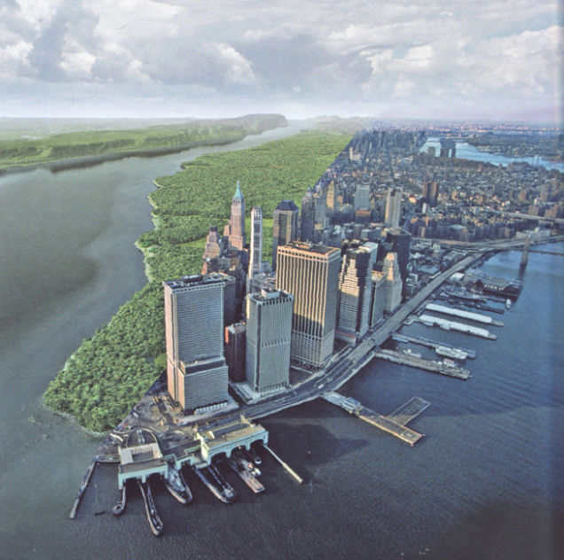
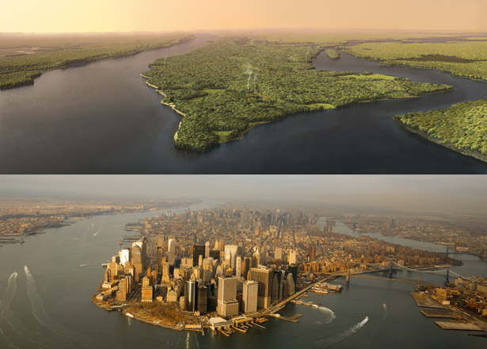
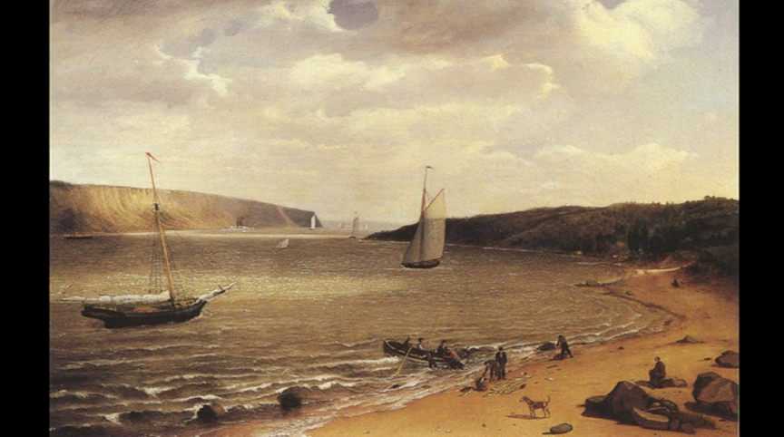

# 从城市开始讲起

这个世界是什么样子的？人与物在这个世界又是怎么联系在一起的？纽约这个大都市，周围都是人造建筑。虽然在农村可以看见稻田， 但时不时会想，在这些水泥道路，高楼大厦出现之前， 大地是什么样的一种情景。这些东西是怎么规划建造的，材料从何而来。城市，法律，GDP，学校，这些个名词又是怎么个回事。从小生活到长大工作挣钱生活，一切都很自然，但好像一直被一层迷雾挡着，于是我想拨开这层迷雾，把我的探索过程与你们分享。

这个探索过程重要的一点是我不可能是完全正确的，而且我想通过简单直观的解释来解答问题，如果我的解答不正确，或者你有更好的解释，更令人通俗易懂的答案，十分欢迎和我分享。还有就是提出你自己想要知道的问题，让我们一起探索它的答案。

那从哪里开始呢？既然我住在纽约市，而它又是一个被人类改造的最多的地方之一，我想应该可以借助对纽约城市历史的探索，以此来了解世界的各个角落。那我们的起点就是纽约曼哈顿，一个你们或多或少了解的城市，至少你听过时代广场，中央公园，世贸中心吧。

要完全了解一种事物，没有比从它起源时间开始更好的方法了，那在人类踏足纽约曼哈顿之前，这片土地又是怎么样的一个情景呢？我在纽约市时不时会看见房子重建和道路翻修，在这些房子和道路下面都只是一些沙石混合物，连泥土都几乎没有，难道纽约曼哈顿就是这样只有沙石的土地，当然不可能，中央公园这么大的植被茂盛的区域不可能被只有沙石的土地包围着。下面我们看一下在人类涉足纽约曼哈顿之前的在1600年左右的图片展示图。

***

***

很不可思议对吧，或者你不相信，也对，这么久以前，人类的科技根本就不可能通过照片记录下纽约曼哈顿。其实上面的照片是根据生物，植被，土壤的分布研究后由地理生态学家Eric Sanderson做的人为推测建模。单单纽约曼哈顿这个地方就有几十种生态区，不同的土壤植被。那这个可信吗？当然不会100%没有出入，我们还没有发明时光机，还不能回到以前去看看当时是什么样子的。以下是Eric Sanderson在TED的演讲，有兴趣你就看看。

***

	<iframe src="https://embed.ted.com/talks/eric_sanderson_pictures_new_york_before_the_city" width="640" height="360" frameborder="0" scrolling="no" webkitAllowFullScreen mozallowfullscreen allowFullScreen></iframe>

***

当时没有照片，却有油画，在视频当中也有展示，我们看看当时和现在的区别。油画是 john james audubon 在今天west 125th street 西125街，朝着同一个方向在 george washington bridge 华盛顿大桥还没建之前的时候画的 在油画下面是同个地点用google地图截图的照片，你可以看到远处华盛顿大桥的轮廓。

***

***

来到纽约曼哈顿，殖民者就开始建造房子和道路。你是否看过西部片中那些酒馆前的道路总是灰尘飘扬，下过雨后就泥泞不堪，那是因为他们那个时候的道路修建技术还不行，把土路整平坦就不错了。现在的道路都是水泥或者沥青混合物，开始建造房子和道路之前，会清理你要建造地方的树木和任何障碍物。

那些入住纽约曼哈顿的最早移民，就跟住在现在的郊区新开发的乡镇一样，走路，骑自行车，开车出行的时候，道路四周都是树木植被，时不时看见动物窜来窜去，房子跟房子之间都还有大自然的树木隔着，想想就觉得这种景象很有意思。

建造的材料从何处而来？就地取材？不可能，附近的资源不可能足以建造我们今天看到的纽约曼哈顿，材料是从不同地方的采石场，采砂场等运来的，经过工厂加工处理成为建筑材料，然后由工人建造而成，围绕今天的市政府中心，一步步扩建到今天我们所见到的纽约曼哈顿。

我们人类智力开发后，会使用工具，掌握不同的科学技术，化学，物理，生物学等等，然后建造城市，发明不同对人类有帮助的东西，本质上是人类把地球改造成的让人类住的更舒适的星球。

用上帝视角，从太空看到地球全貌，我们人类所做的事情，就是利用地球现有的资源， 改造地球成为更加适合居住的地方。有山阻碍建设道路，就用发明的炸药炸平，否则用机器转个洞过去，不平坦的地方，就填平，填充的材料可以来自炸掉的山或者其他地方的矿产。再用材料在平坦的道路上铺上一层水泥，一条现代公路就建造好了。在“三体”小说中，在人类发展到一定阶段的时候，整个地球是完美的平坦球体，整个表面都铺着类似玻璃质感材料的外壳。

各种矿产的提炼，把各种物质分类，用科学提高纯度，去除杂质，然后在组合在一起，变成我们想要的先进器材。是不是象公司一样，每个人专门处理一个专业事项，一起合作发挥最大的作用。

你是否听说过或者玩过"simcity 模拟城市"这个游戏，建立一个让人赏心悦目，生活舒适的城市，你不可能花花草草随意摆放，不美观，又妨碍道路交通，一般都是把它们都移植到一个地方，变成公园，而树木要整齐的排列在道路才美观，道路要规划才不会塞车，工业区和居民区不能紧靠导致生活质量下降。

其实我们做的事情本质就是：地球的资源摆放太随意了，你这个地球怎么可以把各种矿物跟沙石泥土混合在一起，树木怎么可以这里长一个，那里又长一个，你这个地球要听我们人类的话，我要你把各种物质归类好等待我的分配，树木要根据我们人类的要求长在我们想要的地方, 你的淡水资源怎么可以在山的另一头，看我不把这个山炸掉，把淡水引过来。反正一句话就是你个地球要听话，我要你怎样你就得怎样。

总而言之，我们在世界上的活动，就是改造地球的活动。接下来要谈论的就是人类在各个地方和领域的具体活动，还有就是尝试让人通俗易懂的解释一些比较让人困惑的问题，比如资源会不会耗尽。然后就是第二部分关于金钱和其相关的名词(物价上涨，GDP)等等。

### 参考资料:

https://www.amazon.com/Mannahatta-Natural-History-York-City/dp/1419707485

